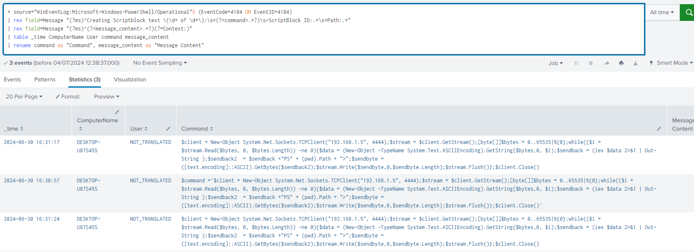

## Execution (TA0002): The Activation of Malicious Actions

Execution in MITRE ATT&CK encompasses techniques that result in the execution of adversary-controlled code on a local or remote system. Once attackers have established initial access, the next critical step is to run malicious code to achieve their objectives. Execution is essential for attackers to carry out their intended actions, whether they aim to steal data, disrupt operations, or establish deeper control within the network.

MITRE ATT&CK details a variety of techniques that attackers use for Execution. Common techniques include:

**Command and Scripting Interpreter:** Attackers use interpreters like PowerShell, Bash, or Python to execute commands and scripts that facilitate malicious activities. These tools offer flexibility and can often bypass security controls.

**User Execution:** This technique relies on tricking users into running malicious files or programs. Examples include double-clicking on infected email attachments or downloading and running software from untrusted sources.

**Inter-Process Communication:** Attackers exploit mechanisms that allow processes to communicate and share data, such as Dynamic Data Exchange (DDE) or Component Object Model (COM) objects, to execute malicious code.

**Native API:** Leveraging system APIs allows attackers to run code with the same privileges as the compromised application, often evading detection.

**Scheduled Task/Job:** Malicious tasks are scheduled to run at specific times or intervals, using built-in system utilities like Task Scheduler or cron jobs.

**Exploitation for Execution:** Attackers exploit software vulnerabilities to execute arbitrary code. This includes buffer overflow attacks, where malicious code is injected into a vulnerable program's memory.

**Third-Party Software:** Compromising and utilizing legitimate software to execute malicious actions. Attackers may inject code into commonly used applications or replace legitimate executables with malicious versions.

By successfully executing malicious code, attackers can perform a wide range of harmful actions, including data exfiltration, system manipulation, and the establishment of persistence mechanisms. Execution is a pivotal step that enables attackers to progress their operations and achieve their ultimate goals.

The technique we used from this tactic is `Command and Scripting Interpreter: PowerShell` which is actually a sub technique of  `Command and Scripting Interpreter`  

## Command and Scripting Interpreter: PowerShell (T1059.001)

PowerShell is a versatile and powerful scripting language and command-line shell used predominantly in Windows environments for task automation and configuration management. Due to its extensive capabilities and deep integration with the Windows operating system, PowerShell is often leveraged by attackers to execute malicious code, automate tasks, and manipulate systems. This makes it an effective tool for executing a wide range of malicious activities.

MITRE ATT&CK details several techniques attackers use with PowerShell. Common techniques include:

**Remote Command Execution:** Attackers can execute commands on remote systems using PowerShell, allowing them to control multiple machines from a single interface. This is often achieved through Windows Remote Management (WinRM) or other remote execution methods.

**Script Execution:** PowerShell scripts, typically with the .ps1 extension, automate complex tasks. Attackers use scripts to download additional payloads, modify system configurations, or exfiltrate data. These scripts can be run directly from the command line or embedded in other files.

**Fileless Malware:** PowerShell is frequently utilized in fileless malware attacks, where malicious code is executed directly in memory without writing to the disk. This reduces the footprint of the attack and complicates detection and forensic analysis.

**Obfuscation:** Attackers often obfuscate PowerShell scripts to evade detection by security tools. Techniques include encoding scripts in Base64, using aliases, or employing complex variable names to make the script difficult to read and analyze.

**Persistence:** PowerShell can establish persistence on a compromised system. This can be done by creating scheduled tasks, modifying registry keys, or using Windows Management Instrumentation (WMI) to ensure the malicious code runs on system startup.

**Living off the Land:** PowerShell's native presence on Windows systems allows attackers to use it without needing to download additional tools. This minimizes the footprint of their activities and reduces the likelihood of detection.

**Data Exfiltration:** PowerShell scripts can collect and exfiltrate sensitive data from a compromised system. Attackers leverage built-in cmdlets for network communication to send data to an attacker-controlled server.

By leveraging PowerShell, attackers can perform a wide range of malicious actions with minimal detection. The flexibility and power of PowerShell make it an attractive tool for adversaries seeking to execute code, automate tasks, and maintain control over compromised systems.

## Steps for execution

A single simple payload is used, where the command `whoami` is just used to get info which user has fallen to the `phishing` attack and try to gather more info about this account privileges and what files does he has access to in case we need to `exfiltrate` any files.

After getting the reverse shell from the malicious document all we need to do is execute the `whoami` command

![[02.png]]


## Preparing for the detection

First we need to enable logging of commands executed in powershell as it is by default is disabled on windows system. There is a couple of methods to do so but I will mention a single on that requires only a privileged powershell terminal on the target windows machine. 
```powershell
$scriptBlockLoggingKey = "HKLM:\SOFTWARE\Policies\Microsoft\Windows\PowerShell\ScriptBlockLogging"
if (-not (Test-Path $scriptBlockLoggingKey)) {
    New-Item -Path $scriptBlockLoggingKey -Force
}
Set-ItemProperty -Path $scriptBlockLoggingKey -Name "EnableScriptBlockLogging" -Value 1 -Force
$moduleLoggingKey = "HKLM:\SOFTWARE\Policies\Microsoft\Windows\PowerShell\ModuleLogging"
if (-not (Test-Path $moduleLoggingKey)) {
    New-Item -Path $moduleLoggingKey -Force
}
Set-ItemProperty -Path $moduleLoggingKey -Name "EnableModuleLogging" -Value 1 -Force
$moduleNamesKey = "$moduleLoggingKey\ModuleNames"
if (-not (Test-Path $moduleNamesKey)) {
    New-Item -Path $moduleNamesKey -Force
}
New-ItemProperty -Path $moduleNamesKey -Name "*" -Value "*" -PropertyType String -Force
$transcriptionKey = "HKLM:\SOFTWARE\Policies\Microsoft\Windows\PowerShell\Transcription"
if (-not (Test-Path $transcriptionKey)) {
    New-Item -Path $transcriptionKey -Force
}
Set-ItemProperty -Path $transcriptionKey -Name "EnableTranscripting" -Value 1 -Force

Set-ItemProperty -Path $transcriptionKey -Name "OutputDirectory" -Value "C:\PowerShellLogs" -Force
```

The previous code will make sure the powershell commands will be logged in the `Microsoft-Windows-PowerShell%4Operational.evtx` log file -which is an original log file in every windows system- by modifying some registry keys in a specific paths.

All is left is to make sure the log file is forwarded to the SIEM solution. In our case it really depend on how was the splunk forwarded setup, if you configured it to monitor the path `C:\Windows\System32\winevt\Logs` then the target log file will be available, otherwise you will need to modify the `etc/apps/Splunk_TA_windows/local/inputs.conf` file to include what you want.
## Constructing the detection rule

Now we have the `Microsoft-Windows-PowerShell%4Operational.evtx` log file we need to focus on the Event Id `4103` and `4104`. Where the Event ID 4103 - Module Logging captures details about the execution of commands within PowerShell modules. It provides valuable information for troubleshooting issues or monitoring PowerShell activity. It log The name of the PowerShell module being used, The specific commands executed within the module and any errors or warnings encountered during execution. While Event ID 4104 - Script Block Logging captures the entire script block executed by PowerShell. This is particularly useful for security purposes, as it allows you to see the exact commands being run, even if they are obfuscated or hidden within a larger script. And the logged info are the complete script block executed by PowerShell, Information about the user or process that ran the script and The time and date the script was executed. 

There is a couple of suggested alerts that lead to almost close results

```
* source="WinEventLog:Microsoft-Windows-PowerShell/Operational"  EventCode=4104
| rex field=Message "(?ms)^Creating Scriptblock text \(\d+ of \d+\):\s*(?<command>.*?)\s*ScriptBlock ID:.*\s*Path:.*"
| table _time ComputerName User command
| rename command as "Command"
```

```
* source="WinEventLog:Microsoft-Windows-PowerShell/Operational" EventCode=4103
| rex field=Message "(?ms)^Creating Scriptblock text \(\d+ of \d+\):\s*(?<command>.*?)\s*ScriptBlock ID:.*\s*Path:.*"
| rex field=Message "(?ms)^(?<message_content>.*?)(?=Context:)"
| table _time ComputerName User command message_content
| rename command as "Command", message_content as "Message Content"
```

Or you could use this query that try to combine them both

```
* source="WinEventLog:Microsoft-Windows-PowerShell/Operational"  (EventCode=4104 OR EventID=4104)
| rex field=Message "(?ms)^Creating Scriptblock text \(\d+ of \d+\):\s*(?<command>.*?)\s*ScriptBlock ID:.*\s*Path:.*"
| rex field=Message "(?ms)^(?<message_content>.*?)(?=Context:)"
| table _time ComputerName User command message_content
| rename command as "Command", message_content as "Message Content"
```

And save it as an alert in real time with the appropriate priority. The search result will look like this



